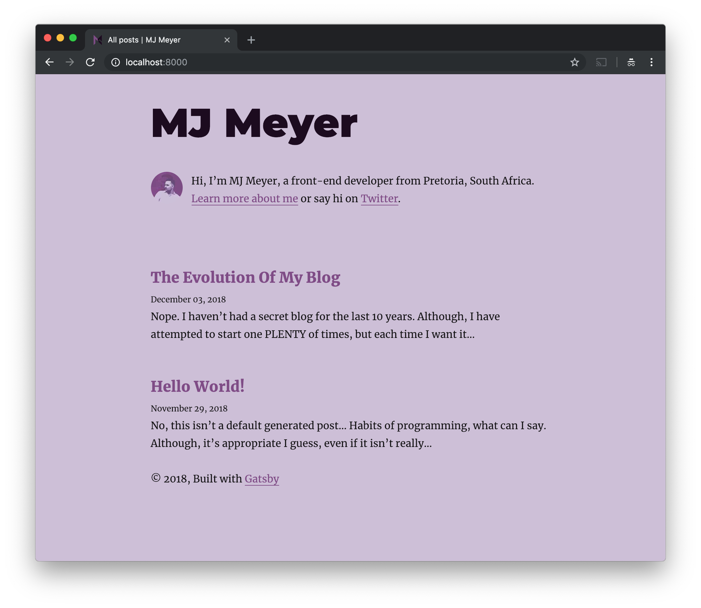

I love open-source! Who doesn’t like a free lunch right? But I firmly believe in sharing credit where it’s due, not just for credits’ sake, but to help others who don’t know about all these awesome free lunches! 😜

I thought this would be a fitting start for the “blog evolution” series. I used a few bits of open-source tech to create this blog, and even though this blog is far from what I want it to be… everything I currently have will be forming the basis of what’s to come.

## The hosting

So my hosting isn’t open-source… but it is FREE! That’s right, this blog is hosted with [Netlify](https://www.netlify.com/)! If you run in any of the web development circles, you should have heard of them by now! If you haven’t smashed that link yet, here’s their intro text from their home page…

> Build, deploy, and manage modern web projects.
> An all-in-one workflow that combines global deployment, continuous integration, and automatic HTTPS. And that’s just the beginning.

And it really is just the beginning. I literally had a version of this site running with everything they mention in the above excerpt in less than 5 minutes. They are that awesome! Honestly, everything you get for free combined with how easy everything is, makes it feel like a steal.

## The Code

If you know Netlify, you know they’re all about static sites (kind of), and then you should know where this is going… I use an open-source static site generator called [Gatsby.js](https://www.gatsbyjs.org/).

Once again, I suggest checking out their website. But in the most simplest terms, I write my posts in markdown files. Gatsby.js takes those files (although it can request data from almost any or multiple sources, eg. API, CSV etc.), turns it into usable data using GraphQL, React then consumes the data, and is then built as static files. This means you get all the benefits of a static website, but with the ease of updating it like a dynamic website.

These static files are then deployed to Netlify each time I push to my master branch on Github. This Gatsby + Netlify combo is pure bliss.

## The Theme

To get my self-sabotaging butt out of the way and not take another year to launch this blog, I decided I’d get up and running with something minimal, and incrementally improve the blog as I go. And if you’re reading this, it obviously worked 😎

So here it is… [The Gatsby Starter Blog](https://github.com/gatsbyjs/gatsby-starter-blog) (Here’s the [demo](https://gatsby-starter-blog-demo.netlify.com/)). Open the Github repo, scroll down to the bottom, click “Deploy to netlify”, and a minute later you’ll have your very own blog up and running on Netlify.

Obviously customising it is a little more complex… but if you read through the Github README file, everything is there to get you up and running. Including the link to the [Gatsby.js in depth tutorial](https://www.gatsbyjs.org/tutorial/).

I made some minor changes to the theme as you’ll see in the image below (included for future reference, I have big plans you know 😉)

---

Do you have a blog? Have you thought about dipping your toes into the [JAMstack](https://jamstack.org/)? Hopefully I’ve convinced you to start this journey with me, or at least given you one less reason to procrastinate like had… Let me know 😉
